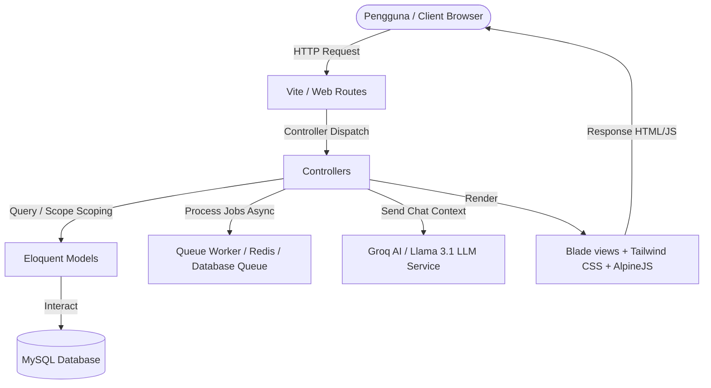
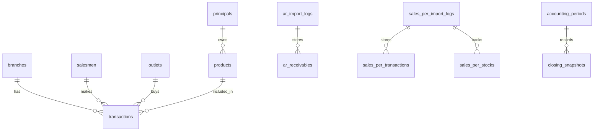
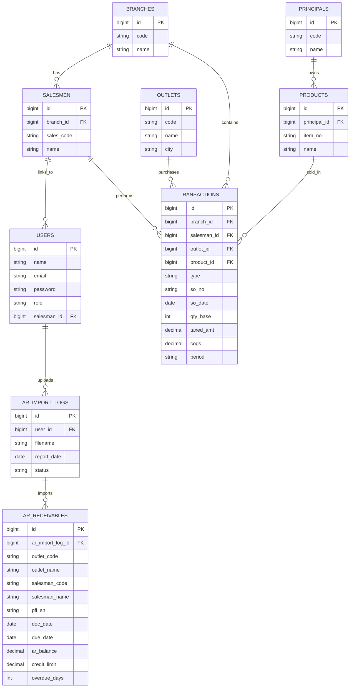
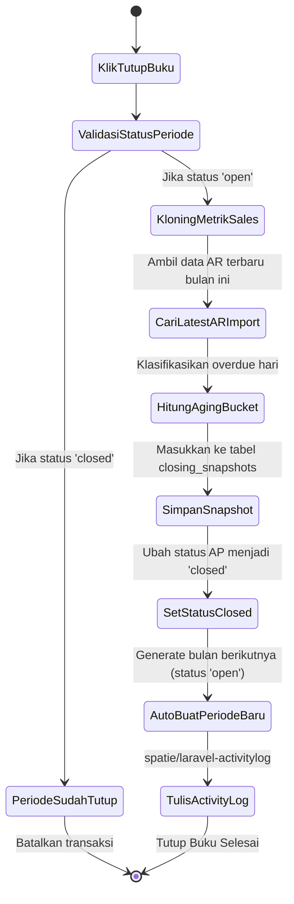

# 🌌 DOKUMENTASI TEKNIS & OPERASIONAL SISTEM - DISTORAVISION

Dokumen ini merupakan panduan referensi tunggal (Master Documentation) untuk arsitektur, basis data, keamanan, algoritma analitik, dan panduan operasional platform **DistoraVision**.

---

## 📌 DAFTAR ISI
1. [Cover & Informasi Proyek](#1-cover--informasi-proyek)
2. [Version History (Riwayat Versi)](#2-version-history-riwayat-versi)
3. [Gambaran Umum Sistem](#3-gambaran-umum-sistem)
4. [Requirement Sistem (Kebutuhan Sistem)](#4-requirement-sistem-kebutuhan-sistem)
5. [Arsitektur Sistem](#5-arsitektur-sistem)
6. [User Roles & ACL (Hak Akses)](#6-user-roles--acl-hak-akses)
7. [Database Documentation (Dokumentasi Basis Data)](#7-database-documentation-dokumentasi-basis-data)
8. [Modul Documentation (Dokumentasi Modul Analitik)](#8-modul-documentation-dokumentasi-modul-analitik)
9. [API & AJAX Documentation](#9-api--ajax-documentation)
10. [Security Documentation (Dokumentasi Keamanan)](#10-security-documentation-dokumentasi-keamanan)
11. [Dashboard Documentation (Panduan Visual Dashboard)](#11-dashboard-documentation-panduan-visual-dashboard)
12. [Installation Guide (Panduan Instalasi)](#12-installation-guide-panduan-instalasi)
13. [User Manual (Panduan Pengguna)](#13-user-manual-panduan-pengguna)
14. [Testing Documentation (Dokumentasi Pengujian)](#14-testing-documentation-pengujian)
15. [Backup & Recovery (Cadangan & Pemulihan)](#15-backup--recovery-cadangan--pemulihan)
16. [Troubleshooting & FAQ (Penanganan Masalah)](#16-troubleshooting--faq-penanganan-masalah)
17. [System Logging & Audit Trail (Log Aktivitas)](#17-system-logging--audit-trail-log-aktivitas)
18. [Lampiran (Diagram, SOP, & Folder)](#18-lampiran-diagram-sop--folder)
19. [Maintenance Guide (Pemeliharaan & Monitoring)](#19-maintenance-guide-pemeliharaan--monitoring)

---

## 1. Cover & Informasi Proyek

*   **Nama Platform:** DistoraVision
*   **Tagline:** Executive Business Intelligence & Predictive Analytics Platform for Secondary Sales Distribution
*   **Pengembang:** Rijalinor & Tim
*   **Bahasa Pemrograman Utama:** PHP 8.2+ (Backend), JavaScript / AlpineJS (Frontend)
*   **Framework Utama:** Laravel 12.x
*   **Status Dokumen:** Rilis Resmi (Final)
*   **Tanggal Pembaruan Terakhir:** 17 Juni 2026

---

## 2. Version History (Riwayat Versi)

| Versi | Tanggal | Penulis | Deskripsi Perubahan |
| :--- | :--- | :--- | :--- |
| **v1.0.0** | 05 Juni 2026 | Rijalinor | Rilis Awal: Modul Secondary Sales, Profil Salesman, & Target Tracker. |
| **v1.1.0** | 06 Juni 2026 | Rijalinor | Integrasi Modul Peramalan Permintaan (Pure Demand Forecasting) berbasis WMA & YoY Seasonality. |
| **v1.2.0** | 08 Juni 2026 | Rijalinor | Rilis Modul Accounts Receivable (AR) Analytics, Import AR, dan integrasi penagihan kritis. |
| **v2.0.0** | 15 Juni 2026 | Rijalinor | Redesain Antarmuka Utama: Tema Sleek Navy (Navy Palette) & Peningkatan Readability Teks. |
| **v2.1.0** | 17 Juni 2026 | Antigravity | Konsolidasi & Rekonstruksi Master Dokumentasi 17 Bagian dari Awal. |
| **v2.2.0** | 23 Juni 2026 | Antigravity | Fitur Demo Mode Dinamis (demo@admin.com), mengubah Ranking Salesman menjadi Performa Salesman (Alfabetis), & menambah Slide AR Aging ke TV Wallboard. |

---

## 3. Gambaran Umum Sistem

**DistoraVision** adalah platform *Business Intelligence* (BI) kelas eksekutif yang dirancang khusus untuk menjembatani jurang pemisah antara data transaksi penjualan sekunder mentah dari distributor dengan keputusan strategis manajemen puncak (C-Suite). 

### Masalah yang Dipecahkan:
1.  **Overstock & Stockout:** Kesalahan estimasi pengadaan barang akibat fluktuasi musiman dan stok kosong historis (OOS).
2.  **Piutang Macet (Bad Debt):** Keterlambatan penagihan piutang toko yang tidak terdeteksi secara dini.
3.  **Target Salesman yang Tidak Adil:** Pembagian target global yang menyamaratakan seluruh area tanpa melihat performa historis.
4.  **Tingginya Retur Barang:** Lemahnya monitoring terhadap kontribusi retur per outlet/salesman.

### Solusi DistoraVision:
*   Menganalisis tren penjualan sekunder secara real-time.
*   Mengklasifikasikan siklus hidup produk (Product Trajectory) dengan analisis Slope regresi linier.
*   Memantau kualitas piutang outlet (AR Analytics) berdasarkan aging bucket, limit kredit, dan prioritas penagihan.
*   Meramalkan kebutuhan stok secara akurat lewat penyesuaian gap stok (OOS Imputation).
*   Mendistribusikan target secara proporsional berdasarkan kontribusi riil 3 bulan terakhir.

---

## 4. Requirement Sistem (Kebutuhan Sistem)

### A. Kebutuhan Server (Minimum)
*   **Operating System:** Windows Server 2019+ / Ubuntu 22.04 LTS
*   **Processor:** Intel Xeon / AMD EPYC (Minimal 2 Cores)
*   **RAM:** Minimal 4 GB (8 GB direkomendasikan untuk pemrosesan file Excel besar)
*   **Database Server:** MySQL 8.0+ / MariaDB 10.5+
*   **PHP Engine:** PHP 8.2+
    *   *Ekstensi PHP Wajib:* `bcmath`, `ctype`, `fileinfo`, `json`, `mbstring`, `openssl`, `pdo_mysql`, `tokenizer`, `xml`, `zip`, `gd`.
*   **Web Server:** Nginx / Apache HTTP Server
*   **Package Managers:** Composer v2.x & Node.js 18+ (NPM v10+)

### B. Kebutuhan Client (Browser)
*   Google Chrome (v100+)
*   Microsoft Edge (v100+)
*   Mozilla Firefox (v100+)
*   Safari (v15+)

---

## 5. Arsitektur Sistem

DistoraVision dibangun menggunakan pola arsitektur **MVC (Model-View-Controller)** yang disediakan oleh **Laravel 12.x** dengan struktur direktori baru yang dirampingkan (*streamlined file structure*).



### Komponen Tech Stack:
1.  **Backend Core:** Laravel 12.x & PHP 8.2.
2.  **Frontend Styling:** Tailwind CSS v3 & AlpineJS v3 untuk manipulasi DOM responsif.
3.  **Visualisasi Data:** ApexCharts untuk chart interaktif di dashboard eksekutif dan AR.
4.  **AI Engine:** Groq API SDK (Model `llama-3.1-8b-instant`) dengan Tool Call untuk query basis data real-time secara aman.
5.  **Job Processing:** Laravel Queue System (menggunakan driver `database` atau `redis`) untuk mengimpor file Excel berukuran besar di latar belakang.

---

## 6. User Roles & ACL (Hak Akses)

DistoraVision menerapkan kontrol akses berbasis peran (*Role-Based Access Control*) dengan tingkatan otorisasi sebagai berikut:

### A. Matriks Hak Akses Modul

| Modul / Fitur | Administrator | Supervisor (SPV) | Salesman | Guest / Viewer |
| :--- | :---: | :---: | :---: | :---: |
| **Unggah Data Excel (Sales/AR)** | Ya | Tidak | Tidak | Tidak |
| **Hapus Batch Import** | Ya | Tidak | Tidak | Tidak |
| **Manajemen User & Hak Akses** | Ya | Tidak | Tidak | Tidak |
| **Tutup Buku (Period Management)** | Ya | Tidak | Tidak | Tidak |
| **Edit Target Salesman** | Ya | Tidak | Tidak | Tidak |
| **Dashboard Executive (Nasional)** | Ya | Tidak | Tidak | Tidak |
| **Dashboard Supervisor (Principal)** | Ya | Ya (Dibatasi Principal) | Tidak | Tidak |
| **My Dashboard (Salesman Personal)** | Ya | Ya | Ya (Milik Sendiri) | Tidak |
| **TV Dashboard Leaderboard** | Ya | Ya | Ya | Ya |
| **AI Chat Assistant** | Ya | Ya (Scoping Data) | Ya (Scoping Data) | Tidak |

### B. Mekanisme Pembatasan Data (Scoping Data)
Untuk menjamin keamanan informasi antar principal dan salesman, sistem menggunakan **Laravel Global Scopes**:
*   **Scoping Salesman:** Jika akun yang masuk memiliki peran `salesman` yang terhubung ke data `salesmen.id`, maka seluruh query ke tabel `transactions` dan `ar_receivables` otomatis disaring hanya untuk baris data yang mengandung `salesman_code` atau `salesman_id` milik user tersebut.
*   **Scoping Supervisor:** Jika akun masuk sebagai `supervisor`, query disaring secara otomatis menggunakan tabel relasi pivot `principal_user` sehingga supervisor hanya dapat melihat produk, penjualan, dan piutang dari principal binaannya.

---

## 7. Database Documentation (Dokumentasi Basis Data)

Berikut adalah kamus data untuk tabel-tabel inti dalam sistem DistoraVision.



### A. Kamus Data Tabel Utama

#### 1. Tabel: `transactions`
Menyimpan transaksi penjualan sekunder utama (Faktur & Retur).
*   `id` (BIGINT, Primary Key, Auto Increment)
*   `branch_id` (FOREIGN KEY -> `branches.id`, Cascade)
*   `salesman_id` (FOREIGN KEY -> `salesmen.id`, Cascade)
*   `outlet_id` (FOREIGN KEY -> `outlets.id`, Cascade)
*   `product_id` (FOREIGN KEY -> `products.id`, Cascade)
*   `type` (ENUM('I', 'R')): `I` untuk Invoice/Faktur, `R` untuk Return/Retur.
*   `so_no` (VARCHAR(100), Nullable): Nomor pesanan penjualan.
*   `so_date` (DATE, Nullable): Tanggal transaksi penjualan.
*   `qty_base` (INT): Jumlah barang dalam unit terkecil.
*   `taxed_amt` (DECIMAL(18,4)): Nilai rupiah transaksi setelah pajak.
*   `cogs` (DECIMAL(18,4)): Biaya Pokok Penjualan (COGS) barang terkait.
*   `period` (VARCHAR(7), Indexed): Format `YYYY-MM` (contoh: `2026-05`).

#### 2. Tabel: `ar_receivables`
Menyimpan piutang outstanding outlet yang diimpor dari modul AR.
*   `id` (BIGINT, Primary Key, Auto Increment)
*   `ar_import_log_id` (FOREIGN KEY -> `ar_import_logs.id`, Cascade)
*   `outlet_code` (VARCHAR(50), Indexed)
*   `outlet_name` (VARCHAR(255), Nullable)
*   `supervisor` (VARCHAR(255), Nullable)
*   `salesman_code` (VARCHAR(50), Indexed)
*   `salesman_name` (VARCHAR(255), Nullable)
*   `pfi_sn` (VARCHAR(100), Indexed): Kunci unik faktur piutang.
*   `doc_date` (DATE)
*   `due_date` (DATE)
*   `top` (SMALLINT): Terms of Payment (dalam hari).
*   `ar_amount` (DECIMAL(18,2)): Nilai awal tagihan piutang.
*   `ar_paid` (DECIMAL(18,2)): Jumlah nominal yang telah dibayarkan.
*   `ar_balance` (DECIMAL(18,2)): Sisa saldo piutang outstanding.
*   `credit_limit` (DECIMAL(18,2)): Limit kredit yang diberikan untuk outlet tersebut.
*   `cm` (TINYINT): Collection Mention (jumlah surat tagihan yang dicetak).
*   `overdue_days` (INT, Indexed): Jumlah hari keterlambatan penagihan.
*   `branch_sheet` (VARCHAR(50)): Nama cabang/sheet asal Excel (contoh: `BJM`).

#### 3. Tabel: `sales_per_stocks`
Menyimpan data stok persediaan fisik produk yang disinkronkan dengan kinerja mingguan.
*   `id` (BIGINT, Primary Key, Auto Increment)
*   `sales_per_import_log_id` (FOREIGN KEY -> `sales_per_import_logs.id`, Cascade)
*   `principal_name` (VARCHAR(255), Nullable)
*   `item_no` (VARCHAR(50), Indexed): Kode unik barang/SKU.
*   `item_name` (VARCHAR(255), Nullable)
*   `on_hand_base` (INT): Jumlah stok fisik di gudang saat ini.
*   `stock_value_on_hand` (DECIMAL(18,4)): Nilai rupiah persediaan di gudang.
*   `was` (DECIMAL(10,4)): Weekly Average Sales (Rata-rata penjualan mingguan).
*   `swc` (DECIMAL(8,2)): Stock Week Cover (daya dukung stok dalam satuan minggu).
*   `age_of_goods` (INT): Umur penyimpanan barang di gudang (hari).
*   `period` (VARCHAR(7), Indexed): Format `YYYY-MM`.

#### 4. Tabel: `closing_snapshots`
Menyimpan ringkasan metrik performa saat proses "Tutup Buku" bulanan dilakukan.
*   `id` (BIGINT, Primary Key, Auto Increment)
*   `accounting_period_id` (FOREIGN KEY -> `accounting_periods.id`, Cascade)
*   `total_sales` (DECIMAL(18,2))
*   `net_sales` (DECIMAL(18,2))
*   `total_outstanding` (DECIMAL(18,2))
*   `total_overdue` (DECIMAL(18,2))
*   `aging_data` (JSON, Nullable): Penyimpanan sebaran aging bucket outstanding.
*   `salesman_sales_data` (JSON, Nullable): Ringkasan pencapaian omset per salesman.
*   `salesman_ar_data` (JSON, Nullable): Ringkasan piutang per salesman.

---

## 8. Modul Documentation (Dokumentasi Modul Analitik)

### Modul 1: KPI Command Center (C-Suite Intelligence)
Menyediakan ringkasan eksekutif untuk Direktur/Owner mengenai profitabilitas dan pertumbuhan penjualan bulanan secara real-time.
*   **Net Sales:** `Omset Kotor - Total Retur`
*   **Gross Margin %:** `((Net Sales - Net COGS) / Net Sales) * 100`
*   **MoM Growth %:** `((Net Sales Bulan Ini - Net Sales Bulan Lalu) / Net Sales Bulan Lalu) * 100`

### Modul 2: Proportional Target Tracker
Sistem alokasi target penjualan global ke setiap salesman berdasarkan performa historis.
*   **Rasio Kontribusi:** `Omset Salesman i (3 Bulan Terakhir) / Total Omset Tim (3 Bulan Terakhir)`
*   **Target Baru Salesman:** `Rasio Kontribusi * Target Global Perusahaan`
*   **Pace Harian (Run Rate):** `(Target Baru - Omset MTD Berjalan) / Sisa Hari Kerja`

### Modul 3: Salesman 360° Appraisal
Profil analisis performa individu salesman. Menilai tingkat kunjungan efektif (strike rate), rasio pengembalian barang (return-to-sales ratio), serta efektivitas penagihan piutang (collection rate).

### Modul 4: Outlet & Principal Intelligence
*   **RFM Segmentation:** Mengelompokkan outlet secara dinamis ke dalam 4 kategori berdasarkan *Recency*, *Frequency*, dan *Monetary Value*:
    *   *Champions / Loyal:* Transaksi baru, sering, nilai belanja tinggi.
    *   *At Risk:* Lama tidak bertransaksi namun nilai transaksi historis tinggi.
    *   *Hibernating:* Jarang belanja, nilai transaksi kecil, dan sudah lama tidak aktif.
*   **Brand Affinity Mapping:** Menganalisis sebaran pembelian produk antar principal di setiap outlet guna menemukan potensi penjualan silang (*cross-selling*).

### Modul 5: AR Analytics (Accounts Receivable)
Memantau piutang outlet berdasarkan umur faktur jatuh tempo.
*   **Overdue Days:** `Tanggal Laporan - Tanggal Jatuh Tempo`
*   **Aging Buckets:** `Current (Belum Jatuh Tempo)`, `1-30 Hari`, `31-60 Hari`, `61-90 Hari`, `>90 Hari`.
*   **Collection Rate %:** `(Total Bayar Piutang / Total Nilai Piutang Awal) * 100`

### Modul 6: Sales vs Stock Analytics (Stock Week Cover)
Menganalisis tingkat kesehatan ketersediaan stok fisik gudang terhadap rata-rata penjualan mingguan (WAS).
*   **Formula SWC:** `Stok Gudang / WAS (Rata-rata Penjualan Mingguan)`
*   **Status Kritis:** `SWC <= 2` (Persediaan terancam kosong).
*   **Status Dead Stock:** `SWC > 12` atau Penjualan produk = 0 dalam periode berjalan.

### Modul 7: Restock Predictor
Menghitung siklus belanja rata-rata untuk memproyeksikan tanggal transaksi berikutnya bagi tiap outlet.
*   **Siklus Hari:** Rata-rata selisih hari antar pesanan dari toko yang sama.
*   **Estimasi Tanggal Restock:** `Tanggal Transaksi Terakhir + Rata-Rata Siklus Hari`

### Modul 8: Predictive Demand Forecasting
Mesin proyeksi kebutuhan produk berbasis data deret waktu (Time Series) dengan 4 langkah perhitungan utama:
1.  **Imputasi OOS:** Baseline penjualan dinaikkan otomatis untuk mengompensasi hari-hari barang kosong.
2.  **Base WMA:** Perhitungan Moving Average berbobot 3 bulan: `(T-1 * 50%) + (T-2 * 30%) + (T-3 * 20%)`.
3.  **Seasonality YoY:** Rasio penjualan bulan target tahun lalu dibagi rata-rata penjualan 12 bulan tahun lalu.
4.  **Final Forecast:** `Base WMA * Seasonality YoY` (Dibulatkan ke atas).

### Modul 9: AI Chat & Insight Generator
Integrasi asisten virtual Distora AI berbasis Groq API (`llama-3.1-8b-instant`). Dilengkapi dengan pustaka instruksi `AiToolsService` untuk mengambil data penjualan, tren 6 bulan, status stok, dan piutang bermasalah secara langsung lewat *SQL Tool Call* tanpa membocorkan database secara mentah.

### Modul 10: TV Wallboard Dashboard
Tampilan layar monitor otomatis (*Wallboard*) di kantor cabang. Berfungsi menampilkan metrik performa secara periodik melalui 3 slide dinamis:
1. **Global MTD Performance**: Menampilkan pencapaian omset tim terhadap target bulan berjalan beserta sisa gap pencapaian.
2. **Top Entities**: Menampilkan rangkuman Top 5 Principal dan Top 5 Outlet Terlaris.
3. **Accounts Receivable (AR) Summary**: Menampilkan total outstanding piutang, sebaran aging jatuh tempo (>30 hari & >90 hari), serta daftar 5 outlet dengan saldo piutang terbesar.

---

## 9. API & AJAX Documentation

Aplikasi ini menggunakan perutean monolitik dengan beberapa endpoint AJAX yang merespons dalam format JSON untuk kebutuhan pembaruan antarmuka secara dinamis.

### A. Endpoint: AI Chat Response
*   **URL:** `/ai-chat/ask`
*   **Method:** `POST`
*   **Headers:** `Content-Type: application/json`, `X-CSRF-TOKEN`
*   **Payload Request:**
    ```json
    {
      "history": [
        {"role": "user", "content": "Berapa net sales bulan Mei 2026?"}
      ],
      "model": "llama-3.1-8b-instant"
    }
    ```
*   **Format Respons Sukses (Status 200):**
    ```json
    {
      "reply": "Net sales untuk periode Mei 2026 adalah Rp 4.567.890.000 dengan laba kotor sebesar Rp 890.000.000 (Margin 19.5%).\n\nPendapat Distora AI: Performa penjualan stabil namun perhatikan peningkatan retur sebesar 2% MoM.",
      "remaining_tokens": "78200"
    }
    ```

### B. Endpoint: Dynamic Stock Tabs Loader
*   **URL:** `/sales-per/stock/tab-kritis` | `/sales-per/stock/tab-tertahan` | `/sales-per/stock/tab-semua`
*   **Method:** `GET`
*   **Query Parameters:**
    *   `period` (format `YYYY-MM`, opsional)
    *   `principal` (nama principal, opsional)
*   **Format Respons:** HTML parsial (Blade Rendered View) berisi baris tabel persediaan yang dimuat secara asinkron (*lazy load*) oleh AlpineJS untuk mempercepat waktu pemuatan halaman awal.

---

## 10. Security Documentation (Dokumentasi Keamanan)

### A. Proteksi Sistem Autentikasi & Sesi
*   **Laravel Breeze:** Autentikasi kredensial pengguna dilindungi oleh enkripsi hashing bcrypt.
*   **Session Lifetime:** Sesi tidak aktif disetel otomatis kedaluwarsa setelah 120 menit (konfigurasi `config/session.php`).

### B. Pertahanan Terhadap Kerentanan Web (OWASP Top 10)
1.  **SQL Injection:** Seluruh query basis data menggunakan **Eloquent ORM** dan **PDO Parameter Binding** yang secara otomatis mengamankan input dari eksekusi perintah SQL berbahaya.
2.  **Cross-Site Scripting (XSS):** Blade Templating Engine menggunakan sintaks double kurung kurawal `{{ $variable }}` yang menyaring tag HTML berbahaya secara otomatis sebelum ditampilkan di browser.
3.  **Cross-Site Request Forgery (CSRF):** Setiap request bertipe `POST`, `PUT`, atau `DELETE` wajib melampirkan token CSRF unik yang dihasilkan sistem. Jika token tidak cocok, sistem mengembalikan error status `419 Page Expired`.
4.  **API Rate Limiting:** Endpoint pengiriman AI Chat dibatasi maksimal 10 permintaan per menit (`throttle:10,1`) guna menghindari serangan spamming (DDoS) dan kelebihan kuota Groq API.

---

## 11. Dashboard Documentation (Panduan Visual Dashboard)

### A. Executive Dashboard
*   **Widget Utama:** Kartu Ringkasan (Net Sales, Gross Margin %, MoM Growth %) berlatar belakang gradasi modern Sleek Navy.
*   **AI Insight Banner:** Menampilkan kesimpulan analisis performa bisnis yang dihasilkan asisten AI secara otomatis saat halaman dibuka.
*   **Pareto Chart & RFM Grid:** Diagram batang interaktif ApexCharts yang memetakan outlet kategori A dan principal dengan performa terbaik.

### B. AR Dashboard (Accounts Receivable)
Terdiri dari 8 Tab Navigasi Dinamis:
1.  *Ringkasan (Overview):* KPI Outstanding global, jumlah outlet piutang, dan ringkasan nilai giro berjalan.
2.  *Aging Bucket:* Grafik diagram lingkaran sebaran piutang berdasarkan kelompok umur (Current, 1-30, dll).
3.  *Credit Risk:* Daftar toko dengan utilisasi limit kredit kritis (>80%).
4.  *Top Outlets:* Urutan toko dengan nilai piutang outstanding terbesar.
5.  *Payment Status:* Klasifikasi perilaku pembayaran outlet (Lunas, Sebagian, Macet).
6.  *Salesman AR:* Rekapitulasi sisa piutang dan rata-rata hari overdue per salesman.
7.  *Giro:* Daftar giro aktif yang belum jatuh tempo beserta bank penerbitnya.
8.  *Detail:* Tabel pencarian faktur piutang berbasis teks lengkap.

---

## 12. Installation Guide (Panduan Instalasi)

Ikuti langkah-langkah di bawah ini untuk memasang sistem DistoraVision di server lokal maupun produksi:

### 1. Persiapan Berkas
Ekstrak repositori atau clone dari Git:
```bash
git clone https://github.com/Rijalinor/distoravision.git
cd distoravision
```

### 2. Instalasi Dependensi PHP & JavaScript
```bash
composer install --no-dev --optimize-autoloader
npm install
npm run build
```

### 3. Konfigurasi Lingkungan (`.env`)
Salin berkas template lingkungan dan buat kunci enkripsi aplikasi:
```bash
cp .env.example .env
php artisan key:generate
```
Edit berkas `.env` untuk menyesuaikan koneksi MySQL dan Groq API Key:
```env
DB_CONNECTION=mysql
DB_HOST=127.0.0.1
DB_PORT=3306
DB_DATABASE=distoravision_db
DB_USERNAME=root
DB_PASSWORD=rahasia

GROQ_API_KEY=gsk_xxxxxxxxxxxxxxxxxxxx
```

### 4. Migrasi & Seeding Awal Basis Data
Jalankan migrasi tabel-tabel utama:
```bash
php artisan migrate --force
```

### 5. Konfigurasi Queue Worker (Latar Belakang)
Jalankan worker di server agar sistem dapat memproses file import Excel:
```bash
php artisan queue:work --queue=default --sleep=3 --tries=3
```
*(Direkomendasikan menggunakan aplikasi manager seperti **Supervisor** di Linux untuk menjaga agar queue worker terus berjalan).*

---

## 13. User Manual (Panduan Pengguna)

### A. Panduan Bagi Administrator (Admin)

#### 1. Cara Mengunggah Data Transaksi Penjualan Bulanan
1.  Masuk ke menu **Import Sales** di menu samping.
2.  Klik tombol **Upload File**.
3.  Pilih Periode Transaksi (contoh: `2026-05`), pilih file Excel, lalu klik **Proses**.
4.  Sistem akan memasukkan tugas ke antrean background job. Anda dapat memantau statusnya di halaman riwayat import (`Pending` -> `Processing` -> `Completed`/`Failed`).

#### 2. Cara Melakukan Tutup Buku Bulanan
> [!IMPORTANT]
> Tutup Buku berfungsi untuk menyalin dan "membekukan" data KPI bulan berjalan ke tabel historis `closing_snapshots` agar dapat dianalisis kembali di masa mendatang tanpa takut perubahan data masa lalu.
1.  Masuk ke menu **Tutup Buku / Periods**.
2.  Cari periode bulan berjalan (contoh: `2026-05`).
3.  Klik tombol **Tutup Buku / Close Period**.
4.  Sistem akan merekam seluruh visualisasi, nominal penjualan, dan status piutang terakhir. Status periode akan berubah menjadi `Closed` dan data pada bulan tersebut tidak dapat diubah kembali kecuali admin mengklik **Buka Kembali / Reopen Period**.

---

### B. Panduan Bagi Salesman
1.  Masuk menggunakan akun salesman Anda.
2.  Anda akan diarahkan langsung ke **My Dashboard**.
3.  Di sini Anda dapat melihat pencapaian target MTD berjalan, sisa target yang harus dikejar, *Pace Harian* (Run Rate) penjualan Anda, dan daftar toko binaan yang memiliki piutang jatuh tempo kritis (>60 hari atau CM >= 3) untuk ditindaklanjuti.

---

## 14. Testing Documentation (Dokumentasi Pengujian)

DistoraVision menggunakan framework pengujian **PHPUnit** untuk memastikan fungsionalitas logika analitik, rumus perhitungan, dan pembatasan data (ACL) berjalan dengan benar.

### A. Cara Menjalankan Pengujian
Jalankan perintah berikut di terminal repositori proyek:
```bash
# Menjalankan seluruh suite pengujian secara ringkas
php artisan test --compact

# Menjalankan pengujian khusus pada satu file spesifik
php artisan test --compact tests/Feature/ArImportTest.php
```

### B. Cakupan Pengujian (Test Coverage)
*   **Feature Tests:** Pengujian alur otentikasi login, pengunggahan berkas Excel sales/AR, validasi guard periode tutup buku, simulasi AI Chat, dan verifikasi alokasi pembagian target salesman.
*   **Unit Tests:** Pengujian ekstraksi rumus konversi karton produk, normalisasi kalkulasi hari keterlambatan piutang (overdue), dan pembulatan forecast.

---

## 15. Backup & Recovery (Cadangan & Pemulihan)

Untuk mengantisipasi kegagalan server atau kerusakan data, lakukan pencadangan rutin sesuai prosedur berikut:

### A. Prosedur Backup Otomatis
1.  **Backup Basis Data (MySQL):** Jalankan perintah `mysqldump` untuk mengekspor database ke file SQL terkompresi.
    ```bash
    mysqldump -u root -p distoravision_db | gzip > storage/backups/db_backup_$(date +%F).sql.gz
    ```
2.  **Backup Berkas Unggahan (Excel Logs):** Salin direktori penyimpanan file mentah hasil unggahan.
    ```bash
    tar -czf storage/backups/files_backup_$(date +%F).tar.gz storage/app/public/imports/
    ```

### B. Prosedur Recovery (Pemulihan Data)
Jika server mengalami kerusakan total dan perlu dipulihkan di server baru:
1.  Siapkan database kosong dengan nama yang sama di MySQL.
2.  Ekstrak file backup database:
    ```bash
    gunzip < db_backup_xxxx-xx-xx.sql.gz | mysql -u root -p distoravision_db
    ```
3.  Ekstrak berkas log unggahan ke direktori `storage/app/public/`.

---

## 16. Troubleshooting & FAQ (Penanganan Masalah)

Berikut adalah daftar masalah yang sering ditemui pada sistem DistoraVision beserta langkah penanganannya:

1.  **Error: "Unable to locate file in Vite manifest"**
    *   *Penyebab:* Aset CSS/JS belum di-compile oleh bundler Vite.
    *   *Solusi:* Jalankan perintah `npm run build` di root direktori untuk meng-compile aset untuk produksi, atau jalankan `npm run dev` jika dalam mode pengembangan.
2.  **Error: "Kuota AI sedang penuh" (429 Too Many Requests)**
    *   *Penyebab:* Permintaan ke Groq API melebihi batas limit token per menit (TPM) atau request per menit (RPM) pada akun gratis.
    *   *Solusi:* Sistem secara otomatis melakukan retry jika waktu tunggu singkat. Jika waktu tunggu lama, batasi pertanyaan chat yang terlalu panjang atau tunggu beberapa saat sebelum mengirim chat kembali.
3.  **Error: "Sheet 'BJM' tidak ditemukan" saat Import**
    *   *Penyebab:* Penulisan nama sheet di dalam file Excel yang diunggah tidak mengandung kata pencarian "BJM" (case-insensitive).
    *   *Solusi:* Periksa kembali file Excel Anda, pastikan nama sheet cabang ditulis dengan benar (misalnya `BJM`, `BJM-Sales`, atau `Sales BJM`).

---

## 17. System Logging & Audit Trail (Log Aktivitas)

DistoraVision dilengkapi dengan perekaman jejak audit sistem menggunakan library `spatie/laravel-activitylog`. Setiap tindakan administratif penting yang dilakukan oleh Admin atau pengguna terekam secara permanen di database.

*   **Tindakan yang Dicatat:**
    *   Pembuatan, pembaruan, dan penghapusan pengguna (User Management).
    *   Proses pengunggahan berkas Excel untuk Sales, AR, dan Stok.
    *   Eksekusi proses Tutup Buku bulanan dan pembukaan kembali periode.
    *   Perubahan konfigurasi pemetaan kolom (Column Mapping).
*   **Cara Membaca Log:**
    Admin dapat memantau log aktivitas secara langsung melalui menu **Settings -> Activity Logs** di dashboard Admin untuk melakukan audit keamanan jika terjadi ketidaksesuaian data.

---

## 18. Lampiran (Diagram, SOP, & Folder)

### A. ERD (Entity Relationship Diagram) Lengkap
Berikut adalah diagram hubungan entitas lengkap di dalam database DistoraVision:



### B. Use Case Diagram
Menggambarkan interaksi aktor (Admin, Supervisor, Salesman) dengan sistem:

```mermaid
usecaseDiagram
    actor Admin
    actor Supervisor
    actor Salesman

    usecase "Unggah Excel & Import Data" as UC1
    usecase "Tutup Buku Bulanan" as UC2
    usecase "Manajemen User" as UC3
    usecase "Melihat Dashboard Executive (Nasional)" as UC4
    usecase "Melihat Dashboard Supervisor (Principal Terbatas)" as UC5
    usecase "Melihat My Dashboard (Salesman Terbatas)" as UC6
    usecase "Tanya Jawab AI Chat (Scoped Data)" as UC7
    usecase "Melihat TV Leaderboard" as UC8

    Admin --> UC1
    Admin --> UC2
    Admin --> UC3
    Admin --> UC4
    Admin --> UC7
    Admin --> UC8

    Supervisor --> UC5
    Supervisor --> UC7
    Supervisor --> UC8

    Salesman --> UC6
    Salesman --> UC7
    Salesman --> UC8
```

### C. Activity Diagram: Proses Tutup Buku
Menggambarkan alur aktivitas penutupan buku periode berjalan oleh Administrator:



### D. Sequence Diagram: Alur Tanya Jawab AI Chat
Menggambarkan urutan pesan antar komponen saat pengguna berinteraksi dengan asisten AI:

```mermaid
sequenceDiagram
    autonumber
    actor Pengguna
    participant Browser as Web Browser (AlpineJS)
    participant Ctrl as AiChatController
    participant Service as GroqChatService
    participant Tools as AiToolsService
    participant DB as MySQL Database

    Pengguna->>Browser: Masukkan pertanyaan chat
    Browser->>Ctrl: POST /ai-chat/ask (JSON payload + CSRF)
    Note over Ctrl: Validasi data input & rate limit
    Ctrl->>Service: chat(history, currentPeriod)
    Service->>Service: buildSystemPrompt() & sanitizeUserMessage()
    
    rect rgb(24, 32, 70)
        Note over Service: Round 1: Kirim pesan ke API Groq
        Service-->>Service: API Groq meminta pemanggilan tool database
        Service->>Tools: executeTool(toolName, arguments)
        Tools->>DB: Eksekusi Query SQL (Global ACL Scope aktif)
        DB-->>Tools: Mengembalikan data (Sales / AR / Stok)
        Tools-->>Service: Format hasil tool (JSON string)
    end
    
    Service->>Service: Round 2: Kirim hasil tool ke API Groq
    Service-->>Ctrl: Mengembalikan jawaban final AI + info sisa kuota
    Ctrl-->>Browser: HTTP 200 (JSON response)
    Browser-->>Pengguna: Render jawaban AI di chatbox
```



### E. Screenshot Sistem
Untuk membantu pemahaman visual, berikut adalah deskripsi layout tangkapan layar antarmuka utama DistoraVision:
1.  **Dashboard Utama (Executive Panel):** Memiliki panel atas berisi indikator laba kotor, pertumbuhan MoM, serta banner AI Insight berwarna Slate & Deep Navy. Bagian tengah berisi visualisasi diagram Pareto kontribusi sales menggunakan ApexCharts.
2.  **Dashboard AR (Accounts Receivable):** Dilengkapi navigasi 8-tab dinamis (Overview, Aging, Credit Risk, dll.) dengan tabel detail piutang outlet yang interaktif.
3.  **Layar TV Wallboard:** Desain minimalis full-screen berlatar gelap (Midnight Navy) dengan running text di bagian bawah dan panel leaderboard performa harian salesman di sisi kanan.

### F. Struktur Folder Penting
Pohon direktori utama Laravel 12 pada aplikasi DistoraVision:
```text
distoravision/
├── app/                        # Logika Inti Backend PHP
│   ├── Http/
│   │   ├── Controllers/        # Controllers penanganan request HTTP & AJAX
│   │   └── Middleware/         # Middleware khusus (misal: AdminMiddleware.php)
│   ├── Models/                 # Eloquent ORM Models (Transaction, ArReceivable, dll)
│   ├── Services/               # Logika AI & Integrasi Groq (GroqChatService, AiToolsService)
│   └── Traits/                 # Fitur reusable (misal: FilterableTransactions.php)
├── bootstrap/                  # Inisialisasi framework & Registrasi middleware Laravel 12
├── config/                     # Berkas konfigurasi sistem (database, import, dll)
├── database/
│   ├── migrations/             # Struktur skema tabel database
│   └── seeders/                # Pengisian data simulasi/demo awal
├── resources/                  # Aset Frontend & View Templates
│   ├── views/                  # File template HTML (.blade.php)
│   └── css/                    # File konfigurasi styling
├── routes/
│   ├── web.php                 # Rute utama aplikasi web
│   └── auth.php                # Rute otentikasi login/logout
└── tests/                      # Suite pengujian otomatis (PHPUnit)
```

### G. SOP Penggunaan Sistem (Standard Operating Procedures)

#### SOP 1: Pengunggahan Data Awal Bulan (Admin)
1.  **Persiapan:** Siapkan file Excel yang berisi data transaksi bulanan (Sales, AR, dan Stok) dari sistem ERP distributor.
2.  **Login:** Masuk ke platform DistoraVision menggunakan akun dengan peran **Admin**.
3.  **Unggah Sales:** Buka menu **Import Sales**, pilih file Excel transaksi penjualan, pilih nama sheet yang sesuai (contoh: `Sales BJM`), isi tanggal periode, lalu klik **Unggah**.
4.  **Unggah AR:** Buka menu **Import AR**, pilih file Excel piutang, pilih nama sheet, isi tanggal pelaporan, lalu klik **Unggah**.
5.  **Verifikasi Antrean:** Pantau halaman riwayat import untuk memastikan status berubah dari `Pending` -> `Completed`. Jika status `Failed`, periksa log error yang muncul untuk melakukan pembenahan kolom Excel.

#### SOP 2: Analisis Kinerja & Piutang Toko (Salesman / Supervisor)
1.  **Dashboard Pribadi:** Masuk menggunakan akun Salesman untuk melihat ringkasan performa penjualan Anda sendiri.
2.  **Monitoring Target:** Perhatikan metrik **Pace Harian (Run Rate)** untuk mengetahui berapa rata-rata nominal penjualan yang harus dicapai per hari agar target bulanan terpenuhi.
3.  **Penagihan Piutang:** Buka menu **AR Dashboard**, filter daftar toko berdasarkan kategori **Jatuh Tempo Kritis (>60 Hari)** atau yang memiliki flag **Collection Mention (CM) >= 3** untuk diprioritaskan penagihannya minggu ini.

#### SOP 3: Proses Tutup Buku Bulanan (Admin)
1.  **Validasi Akhir Periode:** Pastikan tidak ada berkas impor data transaksi penjualan atau piutang tambahan untuk bulan tersebut.
2.  **Eksekusi:** Buka menu **Periods**, pilih baris periode bulan berjalan yang ingin ditutup (misalnya `2026-05`), isi catatan penutupan (opsional), lalu klik **Tutup Buku / Close Period**.
3.  **Verifikasi Snapshot:** Pastikan status periode berubah menjadi `Closed` dan data snapshot KPI penjualan, laba kotor, serta sebaran aging bucket piutang telah tersimpan dan terkunci secara aman.

#### SOP 4: Penggunaan Asisten AI Chat
1.  **Navigasi:** Buka menu **AI Chat** dari menu samping.
2.  **Ketik Pertanyaan:** Kirimkan pertanyaan bisnis spesifik Anda (misalnya: *"Siapa salesman dengan retur tertinggi di bulan Mei 2026?"* atau *"Berikan rekomendasi produk yang berisiko overstock"*).
3.  **Membaca Hasil:** Distora AI akan memanggil tool database secara otomatis di belakang layar untuk memberikan ringkasan analisis serta rekomendasi bisnis yang actionable.

### H. Kode Wilayah Toko Terdaftar (Cabang Kalimantan/Selatan)
```text
AHD, AIR, AML, ANJ, ANT, AUN, AYN, BAI, BJB, BJR, BLG, BLR, BNJ, BPP, BRB, BRL, BRM, BRP, BRS, 
BRU, BTH, BTL, BTM, CAS, CKT, CMR, CNR, DPR, GMB, HRM, IKK, IKN, INP, JHH, JTI, KAU, KLA, KLD, 
KLP, KPG, KPS, KRP, KRU, KTB, LDU, LKS, LMA, LML, MAK, MNR, MRB, MRN, MRP, MTP, OBM, ODM, PBN, 
PHB, PKR, PKU, PLH, PLJ, PLK, PMT, PND, PSM, PST, SDN, SHB, SKR, SMY, SNG, SPD, SPT, STB, TAI, 
TBN, THR, TJG, TLD, TLT, TLW, TPD, TRP, UKA, WKG, WLD, WPC.
```

### I. Pemetaan Kolom File Excel AR (Import AR Mapping)
Berikut adalah konfigurasi pemetaan kolom default yang disematkan dalam berkas `config/import_columns.php`:
*   `ar_pfi_sn` -> `'pfisn'` / `'pfi_sn'` (Kunci Invoice Piutang)
*   `ar_outlet_id` -> `'outlet_id'` / `'outlet_code'` (Kode Unik Toko)
*   `ar_ar_balance` -> `'ar_balance'` / `'outstanding'` (Sisa Saldo Piutang)
*   `ar_overdue_days` -> `'over_due'` / `'overdue'` (Hari Keterlambatan)
*   `ar_credit_limit` -> `'credit_limit'` / `'plafon_kredit'` (Limit Kredit Outlet)
*   `ar_cm` -> `'cm'` / `'collection_mention'` (Status Cetak Tagihan)

---

## 19. Maintenance Guide (Pemeliharaan & Monitoring)

Untuk menjaga performa, stabilitas, dan keamanan sistem agar tetap berjalan optimal, tim Administrator TI wajib menjalankan langkah-langkah pemeliharaan berikut secara berkala:

### A. Monitoring Sumber Daya Server

#### 1. Monitoring CPU (Central Processing Unit)
*   **Tindakan:** Pantau load CPU untuk menghindari bottleneck akibat proses komparasi data atau kalkulasi forecasting WMA yang berat.
*   **Perintah (Linux CLI):**
    ```bash
    # Melihat aktivitas proses CPU secara real-time
    htop
    # atau menggunakan top standar
    top -c
    ```
*   *Rekomendasi:* Jika load CPU konsisten di atas 80% dalam waktu lama, pertimbangkan untuk meningkatkan core CPU server atau optimasi index database.

#### 2. Monitoring RAM (Memory)
*   **Tindakan:** Pastikan memori fisik cukup untuk memuat pustaka pembaca Excel (PhpSpreadsheet) saat melakukan import file besar (>50 MB).
*   **Perintah (Linux CLI):**
    ```bash
    # Memeriksa kapasitas RAM terpakai dan tersisa
    free -h
    ```
*   *Rekomendasi:* Konfigurasi limit memori PHP di berkas `php.ini` (`memory_limit = 512M` atau `1024M` jika perlu) agar proses background queue import tidak mengalami kehabisan memori (*fatal error: out of memory*).

#### 3. Monitoring Disk (Penyimpanan)
*   **Tindakan:** Cek ruang penyimpanan kosong untuk menampung file log aktivitas, log query database, dan file Excel cadangan.
*   **Perintah (Linux CLI):**
    ```bash
    # Memeriksa penggunaan kapasitas partisi disk
    df -h
    ```
*   *Rekomendasi:* Bersihkan berkas log Laravel lama secara periodik di folder `storage/logs/laravel.log` atau gunakan log rotation di server Linux.

### B. Update & Pemeliharaan Sistem

#### 1. Update Laravel (Framework Core)
*   Lakukan update minor framework Laravel 12 secara berkala untuk menambal celah keamanan terbaru (*security patches*).
*   **Perintah:**
    ```bash
    composer update laravel/framework --with-dependencies
    ```

#### 2. Update Dependency (Pustaka Pihak Ketiga)
*   **Pembaruan Backend (Composer):**
    ```bash
    composer update --no-dev
    php artisan migrate --force
    ```
*   **Pembaruan Frontend (NPM):**
    ```bash
    npm update
    npm run build
    ```
    *(Menjalankan kembali `npm run build` wajib dilakukan setiap kali ada perubahan/update aset CSS atau JS agar file manifest Vite terbarui).*

---
*Dokumentasi Master ini disusun secara terperinci untuk memenuhi kebutuhan audit teknis dan panduan operasional pengguna DistoraVision.*
